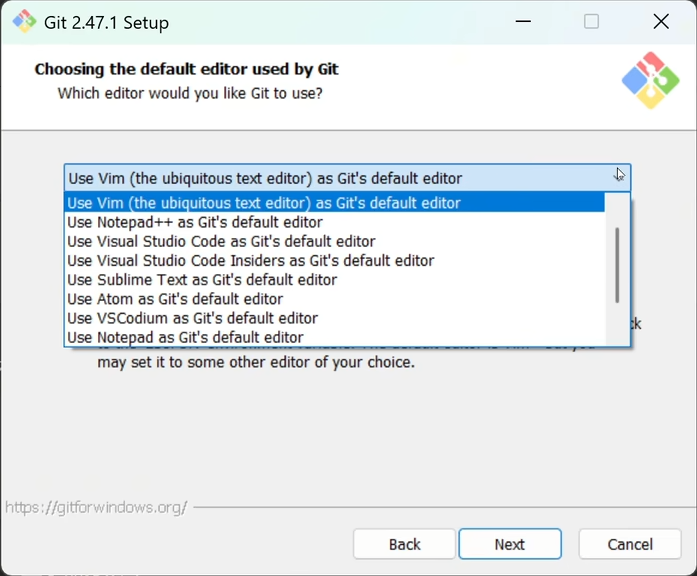
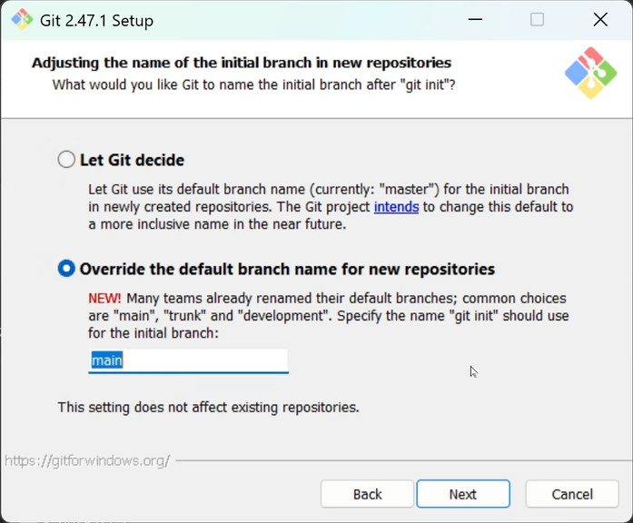

# 安装过程
## 编辑器选择

对于我来说选择VScode编辑器：`Use Visual Studio Code` (稳定版)、`Use Visual Studio Code Insiders` (内测版)
## 初始分支名设置

`Override the default branch name for new repositories`（覆盖新仓库的默认分支名）
后续修改方法：
就算安装时选错了，也可以随时通过命令修改全局默认分支名：
```bash
# 把全局默认初始分支设为 main
git config --global init.defaultBranch main
```
也可以单独给某个仓库改分支名：
```bash
# 把当前仓库的 master 分支重命名为 main
git branch -m master main
```
## 安装完成后先做 3 件事
安装完 Git 后，先不要急着上传项目，先把下面这 3 件基础配置做好。

### 1. 检查 Git 是否安装成功
在 VS Code 中打开终端：

- 顶部菜单：`终端 -> 新建终端`
- 或快捷键：`Ctrl + \``

输入：

```bash
git --version
```

如果能看到类似下面的结果，就说明 Git 已经安装好了：

```bash
git version 2.xx.x.windows.x
```

### 2. 配置 Git 用户名和邮箱
这里的用户名和邮箱会写进你的提交记录里，建议和 GitHub 账号保持一致。

```bash
git config --global user.name "你的GitHub用户名"
git config --global user.email "你的GitHub邮箱"
```

检查是否配置成功：

```bash
git config --global --list
```

你应该能看到类似：

```bash
user.name=你的GitHub用户名
user.email=你的GitHub邮箱
init.defaultbranch=main
```

### 3. 登录 GitHub 网站并准备一个仓库
先去 GitHub 官网登录自己的账号，然后准备一个仓库，后面 VS Code 要把本地项目推上去。

如果你还没有仓库，可以这样创建：

1. 打开 GitHub
2. 点击右上角 `+`
3. 选择 `New repository`
4. 输入仓库名
5. 选择 `Public` 或 `Private`
6. 点击 `Create repository`

建议：

- 如果你是第一次练习，可以先建一个空仓库
- 新手阶段建议不要勾选太多初始化选项，尤其是和本地已有项目对接时，空仓库最省事

## 在 VS Code 中让项目开始被 Git 管理
这一部分是“本地项目 -> 变成 Git 仓库”。

### 1. 用 VS Code 打开你的项目文件夹
不要只打开某一个文件，要打开整个项目文件夹。

路径一般是：

```bash
文件 -> 打开文件夹
```

### 2. 初始化 Git 仓库
如果这是一个还没用 Git 管理的项目，在 VS Code 终端里输入：

```bash
git init
```

执行后，这个项目就变成了一个本地 Git 仓库。

你可以再输入：

```bash
git status
```

如果能看到当前分支、未跟踪文件等信息，就说明初始化成功了。

### 3. 先做第一次提交
把当前项目先保存成第一个版本记录。

```bash
git add .
git commit -m "初始化项目"
```

如果提交成功，说明你的本地仓库已经准备好了。

## 用 VS Code 把本地项目连接到 GitHub
这一部分是“本地仓库 -> 远程仓库”。

### 1. 复制 GitHub 仓库地址
进入你刚才创建好的 GitHub 仓库页面，点击绿色按钮 `Code`。

这里通常会看到两种地址：

- `HTTPS`
- `SSH`

如果你现在只是想先完成基础连接，可以先复制 `HTTPS` 地址，后面我们再专门改成 `SSH`。

类似这样：

```bash
https://github.com/你的用户名/你的仓库名.git
```

### 2. 给本地仓库添加远程地址
在 VS Code 终端输入：

```bash
git remote add origin https://github.com/你的用户名/你的仓库名.git
```

检查是否添加成功：

```bash
git remote -v
```

如果能看到类似下面的结果，就说明远程仓库已经绑定好了：

```bash
origin  https://github.com/你的用户名/你的仓库名.git (fetch)
origin  https://github.com/你的用户名/你的仓库名.git (push)
```

### 3. 把本地代码第一次推送到 GitHub
执行：

```bash
git push -u origin main
```

说明：

- `origin` 是远程仓库默认名字
- `main` 是你当前要推送的分支名
- `-u` 的作用是把本地 `main` 和远程 `origin/main` 关联起来

以后你再推送时，通常只需要：

```bash
git push
```

### 4. 如果 VS Code 弹出登录 GitHub
这是正常的。

如果你使用的是 `HTTPS`，VS Code 可能会让你登录 GitHub 浏览器授权。

按提示完成登录即可。

注意：

- GitHub 现在通常不支持直接用账号密码推送代码
- 如果走 `HTTPS`，一般是浏览器授权，或者使用 Token
- 如果你不想以后总遇到认证问题，推荐改成 `SSH`

## 把 GitHub 远程地址从 HTTPS 改成 SSH
这一部分是你最需要重点掌握的内容。改成 `SSH` 后，通常会比 `HTTPS` 更稳定，也更适合长期使用。

### 先理解一下：HTTPS 和 SSH 的区别

- `HTTPS`：常见、直观，但经常要登录授权
- `SSH`：配置稍麻烦一次，但配好后推送和拉取更省心

所以比较推荐的做法是：

1. 先学会用 `HTTPS` 连上 GitHub
2. 再把远程地址改成 `SSH`

### 1. 查看你当前是不是 HTTPS 地址
在 VS Code 终端输入：

```bash
git remote -v
```

如果你看到的是这种：

```bash
origin  https://github.com/你的用户名/你的仓库名.git (fetch)
origin  https://github.com/你的用户名/你的仓库名.git (push)
```

那就说明你当前用的是 `HTTPS`。

### 2. 在本机生成 SSH 密钥
在终端输入下面这条命令，把邮箱换成你自己的 GitHub 邮箱：

```bash
ssh-keygen -t ed25519 -C "你的GitHub邮箱"
```

如果你的系统或环境不支持 `ed25519`，也可以用：

```bash
ssh-keygen -t rsa -b 4096 -C "你的GitHub邮箱"
```

执行后一般会看到几次提示：

1. `Enter file in which to save the key`
   直接按回车，使用默认位置即可
2. `Enter passphrase`
   可以设置密码，也可以直接回车留空
3. `Enter same passphrase again`
   再输入一次

### 3. 找到并复制公钥内容
先查看公钥：

```bash
type $env:USERPROFILE\.ssh\id_ed25519.pub
```

如果你生成的是 `rsa`，就改成：

```bash
type $env:USERPROFILE\.ssh\id_rsa.pub
```

把输出的一整行内容完整复制下来，通常会以：

```bash
ssh-ed25519
```

或者：

```bash
ssh-rsa
```

开头。

### 4. 把公钥添加到 GitHub
打开 GitHub，进入：

```bash
头像 -> Settings -> SSH and GPG keys -> New SSH key
```

然后：

1. `Title` 随便写一个你能认出来的名字，比如 `my-vscode-pc`
2. `Key type` 保持默认
3. 把刚才复制的公钥粘贴到 `Key`
4. 点击 `Add SSH key`

### 5. 测试 SSH 是否配置成功
在 VS Code 终端输入：

```bash
ssh -T git@github.com
```

第一次连接时，可能会提示你是否继续连接：

```bash
Are you sure you want to continue connecting (yes/no/[fingerprint])?
```

输入：

```bash
yes
```

如果后面看到类似 “Hi 用户名! You've successfully authenticated...” 这样的提示，就说明 SSH 已经打通了。

### 6. 把仓库远程地址从 HTTPS 改成 SSH
现在开始正式切换远程地址。

先把当前远程地址改掉：

```bash
git remote set-url origin git@github.com:你的用户名/你的仓库名.git
```

再检查一次：

```bash
git remote -v
```

如果看到的是这种格式，就表示已经改成功了：

```bash
origin  git@github.com:你的用户名/你的仓库名.git (fetch)
origin  git@github.com:你的用户名/你的仓库名.git (push)
```

### 7. 本地仓库一开始就直接用 SSH 连接 GitHub 新仓库
上面讲的是“先用 `HTTPS`，再改成 `SSH`”。

但如果你已经把 SSH 配好了，其实也可以一开始就直接用 SSH 连接 GitHub 上新建的仓库，不需要先走 `HTTPS`。

适用场景：

- 你已经完成了 SSH 密钥生成
- 你已经把公钥添加到了 GitHub
- 你准备把本地项目直接推到 GitHub 新仓库

操作方法：

先去 GitHub 仓库页面，点击绿色按钮 `Code`，然后切换到 `SSH`，复制类似这样的地址：

```bash
git@github.com:你的用户名/你的仓库名.git
```

然后在本地项目的 VS Code 终端中执行：

```bash
git remote add origin git@github.com:你的用户名/你的仓库名.git
```

检查是否添加成功：

```bash
git remote -v
```

如果看到：

```bash
origin  git@github.com:你的用户名/你的仓库名.git (fetch)
origin  git@github.com:你的用户名/你的仓库名.git (push)
```

就说明你的本地仓库已经直接通过 `SSH` 连上了 GitHub 上新建的仓库。

如果你的本地仓库还没有推送过，接着执行：

```bash
git push -u origin main
```

这样就等于：

- 没经过 `HTTPS`
- 直接用 `SSH` 完成了本地仓库和 GitHub 新仓库的绑定
- 后续继续 `git push`、`git pull` 就可以了

### 8. 再试一次推送
执行：

```bash
git push
```

如果能正常推送到 GitHub，就说明你已经从 `HTTPS` 成功切换到 `SSH` 了。

## 以后在 VS Code 里的日常提交流程
以后你写代码时，通常就按这个顺序走：

```bash
git status
git add .
git commit -m "这次改动说明"
git push
```

如果你想通过 VS Code 图形界面操作，也可以：

1. 左侧点击“源代码管理”
2. 查看改动文件
3. 点击 `+` 暂存改动
4. 输入提交说明
5. 点击“提交”
6. 点击“同步更改”或“推送”

也就是说：

- 你可以用命令行完成 Git
- 也可以在 VS Code 图形界面操作

## 常见问题
### 1. `git push -u origin main` 报错
先检查这几件事：

```bash
git branch
git remote -v
git status
```

重点看：

- 当前分支是不是 `main`
- 远程仓库地址有没有写错
- 本地有没有先提交过一次

### 2. 明明 GitHub 上有仓库，还是推不上去
常见原因：

- 远程地址写错了
- 你没有这个仓库权限
- 当前用的是 `HTTPS`，但认证没过
- SSH 公钥没加到 GitHub

### 3. 不知道自己当前用的是 HTTPS 还是 SSH
直接看：

```bash
git remote -v
```

判断方法：

- 看到 `https://github.com/...`，就是 `HTTPS`
- 看到 `git@github.com:...`，就是 `SSH`

